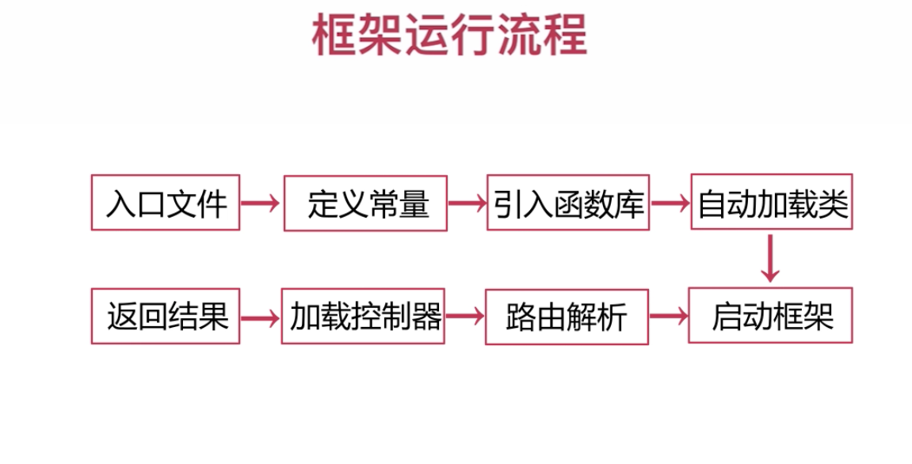

## 项目背景
* 参考&模仿现有CI，Yaf框架实现的功能

## 项目目的
* 熟悉PHP基本语法
* 通过模仿框架，回顾和复习设计模式

## 项目结构
```
├── bootstrap   启动类
├── conf        配置类
├── config
├── controller  处理器
├── core        框架核心类
├── dao         
├── exception   异常
├── model       模型
├── plugins     插件
└── util        工具
```

## 待办功能
|  功能   | 进度  |
|  ----  | ----  |
| 路由请求  | 完成(待改进) |
| 全局捕获异常  | 完成 |
| 加载配置文件  | 未完成 |
| 自动加载类  | 未完成 |

## 入口文件index.php
1. 定义常量
2. 加载函数库
3. 启动框架
```
define('NUWA_START', microtime(true));
define('PROJ_PATH', __DIR__ . '/');
define('APP_PATH', PROJ_PATH . 'app/');
```


# 执行流程

